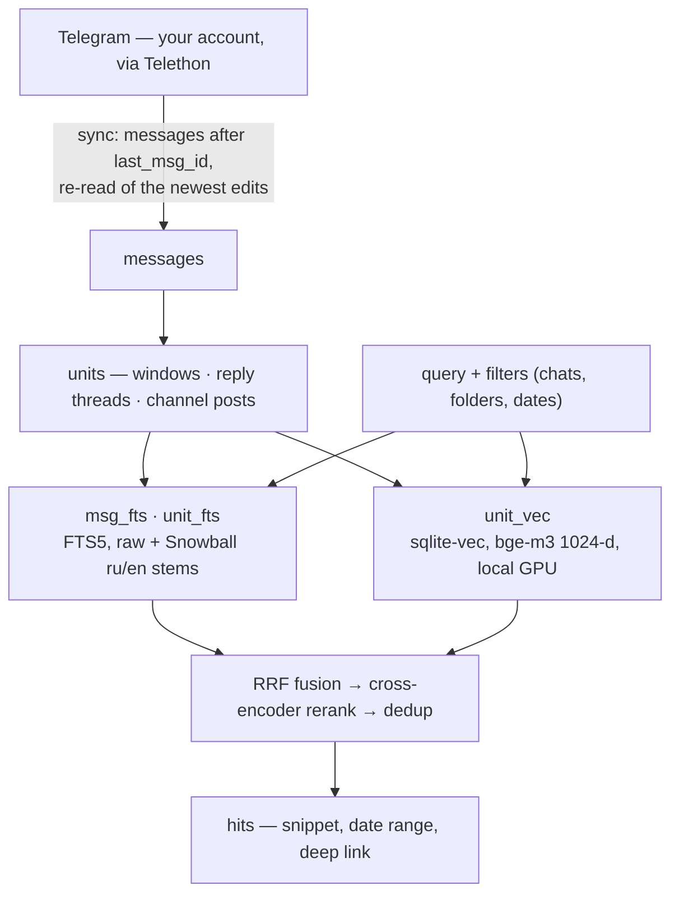

# :mag: grepogram — Semantic Search for Your Telegram Chats

[](https://github.com/nnemirovsky/grepogram/actions/workflows/ci.yml)
[](https://github.com/nnemirovsky/grepogram/releases/latest)
[](pyproject.toml)
[](LICENSE)

Ask your Telegram history a real question and get the conversation that answers it — the whole
thread, when it was said, and a link that opens the message in Telegram.

## Why grepogram

Community chats are where the answers live. Expat groups, city chats, hobby groups hold things no
web page does — how to open a bank account here without a DNI, which SIM works in the mountains,
whether the visa run still works after the June rules. Finding any of it again is the hard part.

**The problem:** Telegram matches exact words. `счёт` misses `счета`, `bank` misses `banks`, and a
paraphrase misses everything. The answers that matter are worse than a single keyword away: they
sit in reply chains, spread across several messages, switch between two languages, and go stale
after a rule change. Embedding single messages does not rescue this either — one chat message is
too short to carry meaning, and the answer usually turns on an exact token anyway: a bank name,
`ВНЖ`, `CUIT`.

**The solution:** grepogram indexes *conversations*, not messages. It syncs the chats you opt in
to through the Telegram user API, groups them into conversation-sized units — time windows, reply
threads, channel posts — and indexes every unit twice: lexically with FTS5 and Russian/English
stemming, so exact tokens still win, and densely with `bge-m3` vectors, so a paraphrase lands.
Both rankings are fused with Reciprocal Rank Fusion, re-scored by a local cross-encoder, and
returned with dates and deep links. An MCP server hands those tools to your agent along with a
playbook for using them: run several query variants, read the thread before concluding, cite a
link per claim.

Your agent supplies the reasoning; grepogram supplies the retrieval. Both models run on your
machine, and every message, vector and query stays in a SQLite file you own.

## How It Works



A separate pass, `grepogram extract`, downloads the photos and attachments those messages carry
and reads the text out of them — OCR through macOS Vision, PDF and DOCX through pure Python — so a
screenshotted announcement is searchable as words rather than as `[photo]`. It runs after a sync,
never inside one; see [Reading Text Out of Media](#reading-text-out-of-media).

Two front ends share that index: `grepogram-mcp`, a stdio MCP server for Claude Code, Cursor,
Codex or any other MCP client, and the `grepogram` CLI for the same searches in a terminal.
Everything lives in one SQLite file.

## Requirements

- macOS. On Apple Silicon the models run on Metal (`mps`), otherwise on the CPU, and the default
  paths follow macOS conventions. The code runs elsewhere with `GREPOGRAM_HOME` set, but that is
  untested.
- [uv](https://docs.astral.sh/uv/). The project pins CPython 3.12 (`torch` and `sqlite-vec`
  wheels); uv installs it. The interpreter's `sqlite3` module must be able to load extensions,
  because sqlite-vec is one: uv's own managed builds and Homebrew's `python@3.12` can, while
  python.org's macOS installer build (`/usr/local/bin/python3.12`, which is also what
  `actions/setup-python` installs) and Apple's system Python cannot — they are compiled without
  `--enable-loadable-sqlite-extensions`. uv prefers an interpreter it finds over downloading its
  own, so the commands below pass `--managed-python`; installed under one of the others,
  grepogram refuses to open the index and prints this same list.
- A Telegram account and an API key pair from https://my.telegram.org/apps.
- Optional: about 4.5 GB of disk for the two models (`BAAI/bge-m3`, `BAAI/bge-reranker-v2-m3`),
  downloaded from Hugging Face on first use. Without them every search runs lexical-only. Once
  they are in the cache they load from it alone: grepogram asks huggingface.co nothing about
  files it already has, and reaches the network only when the cache holds nothing — a first
  download, logged at INFO as one. `HF_HUB_OFFLINE=1` forbids even that, and a model missing
  from the cache then degrades the search instead of downloading.

## Setup in Five Minutes

1. Create an application at https://my.telegram.org/apps and note the `api_id` and `api_hash`.

2. Install as a tool, straight from GitHub — no checkout needed:

   ```sh
   uv tool install --managed-python --python 3.12 \
       'grepogram[dense] @ git+https://github.com/nnemirovsky/grepogram'
   ```

   which puts `grepogram` and `grepogram-mcp` into `$(uv tool dir --bin)`. Drop `[dense]` for a
   lexical-only install, or ask for `[dense,media]` to get OCR and document text as well (see
   [Reading Text Out of Media](#reading-text-out-of-media)). Append `@v0.2.0` — any tag, branch or
   commit — to the URL to pin a version; without one you get the tip of `main`.

   From a checkout instead, to run it in place or to work on it:

   ```sh
   git clone https://github.com/nnemirovsky/grepogram
   cd grepogram
   uv sync --managed-python --extra dense   # or plain `uv sync --managed-python`
   uv run grepogram --help                  # prefix every command below with `uv run`
   ```

   `--managed-python --python 3.12` makes uv install and use its own CPython 3.12 instead of
   whichever `python3.12` it finds first, which is what keeps sqlite-vec loadable (see
   Requirements); `--python /opt/homebrew/bin/python3.12` does as well. Both flags matter for
   `uv tool install`: without `--python` it reuses an environment it already has, so an install
   made under the wrong interpreter stays broken until you pass it (or `uv tool uninstall
   grepogram` first).

3. Write the config and fill in the keys:

   ```sh
   grepogram config init
   grepogram config path          # prints where config, session, index and log live
   ```

   Edit `~/.config/grepogram/config.toml` and set `[telegram] api_id` and `api_hash`.

4. Sign in. The session is stored as `~/.config/grepogram/session.session` with mode 0600:

   ```sh
   grepogram auth                 # phone number, login code, 2FA password if enabled
   ```

5. Pick what to index. Nothing is indexed unless you add it:

   ```sh
   grepogram dialogs argentina                        # find chats and folders by name
   grepogram sources add "folder:Argentina"           # a Telegram folder (all its chats)
   grepogram sources add @ru_georgia                  # a public chat by username
   grepogram sources add "Buenos Aires chat"          # a chat by (fuzzy) title
   grepogram sources add @somechannel --comments      # a channel plus its discussion threads
   grepogram sources add --since 2024-01-01 -- -1001234567890   # by id (after --), skipping older history
   grepogram sources ls
   ```

6. Sync. The first run fetches the whole history of every source (or from `--since`), builds
   the units, indexes them and, when the `dense` extra is installed, downloads `bge-m3` and embeds
   everything. `--budget` caps the run; the next run continues where it stopped:

   ```sh
   grepogram sync --budget 600
   grepogram search "открыть счёт без DNI"
   ```

7. Connect your agent. `grepogram-mcp` speaks MCP over stdio, so any client that launches a
   command works. In Claude Code, with a checkout at `<path>`:

   ```sh
   claude mcp add grepogram -s user -- uv run --project <path> grepogram-mcp
   ```

   or, after `uv tool install`:

   ```sh
   claude mcp add grepogram -s user -- "$(uv tool dir --bin)/grepogram-mcp"
   ```

   Clients that take a JSON config (Cursor, Windsurf, Codex and others) want the same command:

   ```json
   {
     "mcpServers": {
       "grepogram": { "command": "/absolute/path/to/grepogram-mcp", "args": [] }
     }
   }
   ```

   Then ask something like "what do people in the Argentina chat say about opening a bank account
   without a DNI?". The first search downloads the reranker if it is not cached yet.

Run `grepogram sync` whenever you want the index current; the MCP `search` tool also refreshes an
index older than an hour on its own (see below). A `launchd` job or a cron entry calling
`grepogram sync --budget 300` works fine next to a running MCP server: only one sync runs at a
time, and the two never contend for the session file.

## Upgrading from v0.1.x

**An index built by v0.1.x is re-cut and re-embedded once, and that takes a while.** Three of
v0.2.0's changes alter what a *unit* is — `window_max_chars` became a real ceiling, text read out
of media is rendered into the line that used to be a bare `[photo]`, and a unit now carries the
reactions its messages collected — so every stored unit predates the code reading it. Nothing is
re-fetched from Telegram: the messages you already have are cut into units again and the new units
embedded. On a 47,000-unit index that is roughly an hour of local model time.

It happens on its own, and it never takes the index down:

- The re-cut runs at the end of `grepogram sync`, **four whole chats per run at most**. One
  chat's delete, re-cut, index and progress marker are a single transaction, so search keeps
  answering throughout — from the chats that are through and the chats that are not alike.
- An interrupted run loses nothing. Each finished chat is marked with the recipe it was cut at,
  and the next run picks up only the chats that are behind.
- Until every chat is through, `search` returns a warning saying so. The hits next to it are
  valid; they are just cut the old way in the chats that have not moved yet.

**A run whose budget is under 60 seconds does not start one.** A one-time re-cut has no business
being attempted inside a short automatic sync — but that floor has a consequence worth knowing:
the MCP `sync` tool's default `budget_s = 45` is *below* it, and so is the automatic refresh the
MCP `search` tool runs (`auto_sync_budget_s = 20`). **Drive grepogram only through an agent and
the re-cut never starts by itself** — which is exactly what the warning on every search is there
to tell you. Run it from a terminal:

```sh
grepogram sync                 # no --budget means unlimited, which always qualifies
```

as many times as it takes for the warning to go, or call the MCP `sync` tool with a `budget_s` of
at least 60. Either door works; the CLI is the one that works with nothing passed.

Nothing else about the upgrade needs doing. The schema migrates itself when the index is first
opened, the config and the session carry over untouched, and the new `[media]` settings take their
defaults whether or not the file mentions them (`grepogram config init` refuses to overwrite an
existing config — copy the block from [Configuration](#configuration) to spell them out). The
media you already have is *not* read by the upgrade: that backlog waits for a
[`grepogram extract`](#reading-text-out-of-media) run whenever you want it.

## CLI Reference

Global options: `--version`, `--verbose` / `-v` (DEBUG logging). Command output goes to stdout,
diagnostics and logs to stderr and the log file.

| command | what it does |
|---|---|
| `grepogram config init` | write the annotated config template; refuses to overwrite |
| `grepogram config path` | print the resolved config, session, index, lock and log paths |
| `grepogram auth` | sign in (phone, code, optional 2FA password) and store the session |
| `grepogram dialogs <query> [-n N]` | find chats and folders of the account whose title, `@username` or folder name matches; prints kind, id, type, title, username, folders, score |
| `grepogram sources add <target> [--since YYYY-MM-DD] [--comments]` | add a source and save the config; `target` is a chat id, `@username`, `t.me` link, `folder:<name>` or a fuzzy chat / folder title |
| `grepogram sources ls` | configured sources with their chats, message counts and last sync |
| `grepogram sources rm <target>` | remove a source and delete its chats' messages and index rows; `target` is a source id as `sources ls` prints it (`folder:<name>`, `chat:@name`, `chat:-100…`), a folder name, a chat id, `@username` or a fuzzy title; refuses while a sync is running |
| `grepogram sources prune [--dry-run]` | delete the indexed chats a folder source no longer lists — what a folder holds *now* is only knowable from Telegram, so this one needs a session; it prints what would go and asks before deleting, keeps a channel's discussion group and says so, never offers an imported chat, and prunes nothing at all if a source failed to resolve |
| `grepogram sync [--budget S]` | fetch new messages from every source, rebuild units, index and embed; stops cleanly after `S` seconds (at least 1) |
| `grepogram extract [--budget S] [--retry-failed]` | read text out of the media already stored — photos through OCR, PDF and DOCX attachments — and re-cut the units holding it; a network pass, run after `sync`, resumable; `--retry-failed` queues what an earlier run could not read, and what this build had no extractor for, again. See [Reading Text Out of Media](#reading-text-out-of-media) |
| `grepogram prune-deleted [--chat X] [--budget S]` | ask Telegram about every indexed message and drop the ones it no longer has, the discussion group of a channel included; about one request per hundred stored messages, so it is run by hand, resumes where it stopped and is never started by a sync |
| `grepogram import <dir> [--chat-title T]` | index a Telegram Desktop JSON export of a chat this account can no longer open; offline, idempotent, and the chat it creates is marked unavailable so no sync fetches it and no prune offers it |
| `grepogram embed [--reembed]` | embed units the dense index does not hold yet; `--reembed` drops every vector and starts over (needed after changing `[models] embed`); refuses while a sync is running |
| `grepogram search <query> …` | search the index, see below |
| `grepogram thread <chat> <msg_id> [--json]` | print the whole reply thread a message belongs to, root first; for a channel post, the post followed by its comments from the linked discussion group |
| `grepogram context <chat> <msg_id> [--before N] [--after N] [--json]` | print the messages around one in its chat, bounded to the message's own thread or forum topic where Telegram gave it one, the message included (15 each way by default) |
| `grepogram-mcp [-v]` | the MCP server over stdio (what an MCP client launches) |

Chat ids are negative for groups, supergroups and channels (`-100…`); when one is a positional
argument, put `--` before it: `grepogram sources add --since 2024-01-01 -- -1001234567890`.

`search` options:

| option | meaning |
|---|---|
| `-c`, `--chat <spec>` | restrict to these chats (repeatable): id, `@username`, `t.me` link, `folder:<name>` or a title / folder name (substring, then fuzzy) |
| `--since <when>`, `--until <when>` | date bounds on the unit's start: an ISO date (`2025-06-01`), month (`2025-06`), datetime (`2025-06-01T14:30`, optional seconds and `Z` / `+03:00`) or an age (`7d`, `3w`, `6m`, `1y`); `--until` is inclusive; naive input is UTC |
| `--mode hybrid\|lexical\|dense` | `hybrid` (default) fuses BM25 and embeddings, `lexical` is BM25 over stems only, `dense` is embeddings only; without vectors or a model every mode falls back to lexical with a warning |
| `-k`, `--limit N` | number of hits (default `[search] k`) |
| `--rerank` / `--no-rerank` | re-score the candidates with the cross-encoder (default on; skipped with a warning when the model cannot load) |
| `--full` | include each hit's whole unit text |
| `--json` | print the result document as JSON and nothing else on stdout |

Text output prints one block per hit — rank, score, unit kind, chat, UTC date range, the deep link
(and a fallback link for private chats), then the snippet. The `score` ranks the hits of *this*
answer against each other and means nothing across two searches: it is normalised across the
candidate set before the reaction bonus goes on (see [How Search Works](#how-search-works)).

`thread` and `context` are what a hit leads to, the CLI half of the MCP tools of the same names:
read the conversation around a hit instead of guessing from its snippet. `<chat>` takes the same
specs as `-c`, but has to name exactly one indexed chat — a folder name, or a title several chats
share, is an error listing them to pick from. Each message prints as `chat_id/msg_id`, the UTC
timestamp and the sender, then its link and its text; `--json` prints the same
`{chat_id, msg_id, messages}` document the MCP tools return and nothing else on stdout. A channel
post's thread carries the comments from its discussion group, so every message names the chat it
is really in — that is the id to pass back, because the group numbers its messages from 1 exactly
as the channel numbers its posts. Options come before the `--` that protects a negative id:

```bash
grepogram search "открыть счёт без DNI" -k 5
grepogram thread @arg_chat 1284
grepogram context --before 5 --after 5 -- -1001234567890 1284
```

Three commands keep an index honest rather than grow it, and none of them is silent.
`sources prune` deletes the indexed chats a folder source no longer lists. What a folder holds
*now* is only knowable from Telegram, so it resolves over the network first and takes the sync
lock afterwards, for the deletion alone; it prints what would go and what it kept — a channel's
discussion group is kept, and the message names the channel keeping it — and asks before deleting
anything. A source Telegram will not answer for stops the prune outright: a folder that failed to
resolve is not a folder that lists nothing, and treating it as one would offer to delete a whole
indexed history after one transient error.

`prune-deleted` goes the other way. It asks Telegram about every message the index holds, in
batches of a hundred oldest first, and removes the ones Telegram no longer has, following a
channel to its discussion group so a deleted *comment* is caught too. That is about one request
per hundred stored messages, which is why it is yours to run and never a sync's; a run stopped by
`--budget` or a flood wait keeps every batch it finished and the next one carries on from its
cursor. Anything Telegram declines for some other reason is left where it is.

`import` reads a Telegram Desktop export — Settings → Advanced → Export Telegram data, in the
machine-readable JSON format — of a chat this account can no longer open. Its messages are stored,
cut into units and indexed exactly as a sync's are, so `search` answers from them immediately, and
the chat is tagged `import:<slug>` and marked unavailable so no sync fetches it and no prune
offers it. Running the same import again updates what it stored rather than adding a second copy,
and `sources add` over an imported chat is refused by name instead of quietly taking it over.

## Reading Text Out of Media

A photographed embassy announcement, a rental contract as a PDF, a price list someone
screenshotted — before v0.2.0 the index held `[photo]` and `[document: contract.pdf]` and nothing
of what they said. `grepogram extract` reads that text and puts it where search can find it.

```sh
uv tool install --managed-python --python 3.12 \
    'grepogram[dense,media] @ git+https://github.com/nnemirovsky/grepogram'
# from a checkout instead: uv sync --managed-python --extra dense --extra media

grepogram sync                  # first, so there is something to extract
grepogram extract --budget 600  # then, as often as you like; it resumes where it stopped
grepogram sync                  # embeds the units the extraction re-cut
```

**It is a network pass, not an offline one.** Telethon downloads from a message Telegram just
returned and never from a stored row, so every pending message is re-fetched by id before its file
is downloaded — which is also where the file's size comes from. It runs *after* a sync and never
inside one, because a 400-page PDF or a slow OCR must not eat a sync's budget. `--budget` is in
seconds like `sync`'s, a flood wait is respected the same way, each batch of 50 commits on its
own so an interrupted run keeps what it earned, and the downloaded file is deleted whatever
happens to it. Nothing is downloaded at all for media whose kind this build cannot read, or that
`[media]` switches off: those are settled from the stored `media_kind` in three bulk updates
before the first request.

**What the text does.** It is rendered into the unit's line for that message — next to a caption
when there is one, in place of the bare placeholder when there is not — with the `[photo]` /
`[document: …]` marker kept visible, so a reader can always tell that a machine read this off an
image rather than someone typing it. The extraction then re-cuts the units holding those messages
on the spot, closed windows included, which is the whole point: a sync re-cuts only a chat's open
window, and all but the newest handful of any chat's history sits in windows closed long ago. The
re-cut units are indexed immediately and **embedded by the next `grepogram sync`** (or
`grepogram embed`), which is what the command's closing line reminds you to run.

**What it needs.** The `media` extra, which brings `pypdf`, `python-docx` and — on macOS —
`pyobjc-framework-Vision`. PDF and DOCX are pure Python and work anywhere. OCR is macOS Vision, so
it needs a Mac, and **Russian recognition needs macOS 15**: Vision learned Russian there, and
grepogram asks it what it supports and requests only that rather than failing the whole request
over a language the system does not know. Where any of it is missing nothing breaks — the media is
parked as "no extractor here" and `--retry-failed` picks it up once the extra is installed.

Every message with media carries a state, and `grepogram extract` reports them:

| state | what it means | what to do about it |
|---|---|---|
| pending | not looked at yet | `grepogram extract` |
| read | the file was read; the text may still be empty, which is what a photo holding no text looks like | nothing |
| no extractor here | this build cannot read that kind: a video, sticker or poll (which nothing reads), a document without the `media` extra, a photo off macOS or without the extra, or a voice message or video note — those wait for whisper in v0.3.0 | install the `media` extra if it applies, then `grepogram extract --retry-failed` |
| could not be read | a corrupt file, a mislabelled one (a `.docx` holding a PDF), a download that failed | `grepogram extract --retry-failed` |
| too large to download | Telegram reported it larger than `media.max_download_mb`, so it was never fetched | raising the cap does not queue it again; nothing re-reads a skipped file |
| switched off in `[media]` | `enabled`, `ocr` or `documents` is `false` for that kind | switch it back on — the next `extract` queues it again by itself |

`[media]` is documented key by key under [Configuration](#configuration). Turning a kind off is
not destructive: text already extracted stays extracted and stays searchable, and only new work
stops.

## MCP Tools

The server is named `grepogram`. Every tool returns one JSON object. Expected failures — no
session, another sync running, an unknown chat or message, a model that cannot load, an
ambiguous target — come back as `{"error": …, "hint": …}` (plus `candidates` when there is
something to choose from) rather than a tool error, so the agent can act on them. `warnings` are
advisory; the data next to them is valid.

| tool | arguments | returns |
|---|---|---|
| `search` | `query`, `chats: list[str] \| null`, `since`, `until`, `k=10`, `mode="hybrid"`, `rerank=true`, `full=false` | `{hits, warnings, index_age_min, synced}`; each hit has `score` (a within-result-set number — it orders this answer and compares across nothing else), `chat` (id, type, title, username, …), `kind` (`window` / `thread` / `post`), `date_start`, `date_end` (unix seconds, UTC), `anchor_msg_id`, `url`, `fallback_url`, `snippet`, `msg_ids`, `text` (with `full`) |
| `thread` | `chat_id`, `msg_id` | `{chat_id, msg_id, messages}`: the whole reply thread the message belongs to, root first; for a channel post, the post followed by its comments — those live in the discussion group, so the list spans two chats and each message names its own |
| `context` | `chat_id`, `msg_id`, `before=15`, `after=15` | `{chat_id, msg_id, messages}`: the surrounding messages in the same chat, bounded to the message's own thread or forum topic where Telegram gave it one |
| `sync` | `budget_s=45` | the sync report: `new`, `chats_done`, `chats_remaining`, `unavailable`, `warnings`, `index_age_min` |
| `sources` | — | `{sources, index_age_min}`: every configured source with its chats (`id`, `title`, `type`, `username`, `message_count`, `last_sync_at`, `unavailable`) |
| `dialogs` | `query` | `{query, matches}`: chats and folders of the account matching the name; each match carries `kind`, `id`, `title`, `type`, `username`, `folders`, `score` and `target`, the string to pass to `sources_add` |
| `sources_add` | `target`, `since=null`, `comments=false` | `{source, kind, title, chats, hint}` after saving the config |
| `sources_remove` | `target` | `{source_id, removed_chat_ids, config_updated}` after deleting the chats' data; `target` is a source id from `sources` (`folder:<name>`, `chat:<value>`), a folder name, a chat id, `@username` or a fuzzy title; `error` while a sync is running |

Messages in `thread` and `context` have `chat_id`, `msg_id`, `date`, `from_name`, `text` (a
`[photo]`-style placeholder for media without a caption), `url`, `fallback_url` and
`reply_to_msg_id`. A message's `chat_id` is the chat it is really in, which the top-level one
need not be: a channel post's comments come back under the discussion group's id, and comment
ids collide with the channel's post ids (both number from 1), so pass a message's own `chat_id`
back to `context` alongside its `msg_id`.

Four CLI commands have **no tool here, deliberately**: `sources prune` and `prune-deleted` delete
indexed history, `extract` is a long flood-exposed network pass, and `import` reads a directory
the server has no reason to be looking at. They stay in the terminal, and an agent that needs one
should say so rather than find it. The `sync` tool's default `budget_s = 45` is also below the
60-second floor the one-time unit re-cut needs, so an upgraded index is not re-cut by an agent
calling `sync()` with nothing passed — see [Upgrading from v0.1.x](#upgrading-from-v01x).

The server's `instructions` tell the agent how to use the tools: run two or three query variants
(Russian and English, the specific term and the concept, synonyms), prefer `lexical` for exact
tokens such as bank names or IDs, prefer recent hits for anything regulatory or price-related and
state the date of the evidence, call `thread` or `context` before concluding from a snippet, cite
the hit's `url` per claim, say so when nothing relevant comes back, and use `sources` / `dialogs`
/ `sources_add` / `sync` when the user names a chat that is not indexed yet.

The server re-reads `config.toml` when the file changes, so a source added with the CLI while
an agent session runs is picked up by the next tool call. Every change to the file — by the server or
by `grepogram sources add` / `rm` in a terminal — is a read-modify-write under `config.lock`, so
one side's save never undoes the other's. Models are loaded once per server process; a model that
fails to load is not retried until the server restarts.

## Configuration

`grepogram config init` writes this file to `~/.config/grepogram/config.toml` (mode 0600). Every
key is optional; the values shown are the defaults. `grepogram sources add` / `rm` rewrite the
file without comments.

```toml
[telegram]
api_id = 0                             # create an app at https://my.telegram.org/apps
api_hash = ""

[models]
embed = "BAAI/bge-m3"                  # sentence-transformers id; change → full re-embed
rerank = "BAAI/bge-reranker-v2-m3"
device = "auto"                        # auto → mps if available else cpu
max_seq_length = 512                   # token cap for both models; change → `embed --reembed`

[search]
k = 10
rrf_k = 60
rerank_top = 40
dedup_overlap = 0.5
reaction_weight = 0.05                 # most a unit's reactions add to its reranked score
vec_fanout_max = 8                     # above this many chats → one KNN with k*4, post-filtered
auto_sync_after_min = 60
auto_sync_budget_s = 20

[units]
window_gap_min = 30
window_max_msgs = 30
window_max_chars = 1500
thread_max_msgs = 40

[sync]
edit_refetch = 200
flood_sleep_threshold = 120

[media]
enabled = true                         # master switch for the extraction pass
ocr = true                             # photos through macOS Vision (the `media` extra)
documents = true                       # pdf and docx
max_download_mb = 20                   # anything larger is skipped, never downloaded

# Sources are opt-in. Add them with `grepogram sources add <target>` or by hand:
#
# [[sources]]
# folder = "Argentina"
#
# [[sources]]
# chat = "@ru_georgia"                 # or "https://t.me/…" or 123456789
# since = "2024-01-01"                 # optional: skip older history on first sync
# comments = false                     # channels only: also index linked discussion threads
```

| key | meaning |
|---|---|
| `telegram.api_id`, `telegram.api_hash` | the application credentials from my.telegram.org; every command that talks to Telegram refuses to run while they are unset |
| `models.embed` | sentence-transformers model for the dense index; the model name and vector width are recorded in the index, and a change is refused until `grepogram embed --reembed` |
| `models.rerank` | sentence-transformers cross-encoder used when `rerank` is on |
| `models.device` | `auto`, `mps` or `cpu`; on `mps` the weights run in fp16 |
| `models.max_seq_length` | how many tokens of a unit either model reads; the rest is truncated. Raising it embeds more of a long unit and costs encode time — see [Unit length and the token cap](#how-search-works). Nothing detects a change, so it takes effect on an existing index only after `grepogram embed --reembed` |
| `search.k` | default number of hits for the CLI |
| `search.rrf_k` | the constant in `1 / (rrf_k + rank)` |
| `search.rerank_top` | how many fused candidates the cross-encoder re-scores; each retrieval list is fetched `max(k, rerank_top)` deep |
| `search.dedup_overlap` | drop a hit when at least this share of its message ids already belongs to a better hit of the same chat; a value above 1.0 disables dedup |
| `search.reaction_weight` | how much a unit's reactions can raise it after reranking. The cross-encoder's scores are min-max normalised across the candidate set and this much times `log1p(reactions) / (1 + log1p(reactions))` is added, so a well-received message wins a near-tie without a popular unit overtaking a relevant one; `0` switches it off and leaves the reranker's own scores untouched |
| `search.vec_fanout_max` | a chat filter with up to this many chats runs one KNN per chat (sqlite-vec partition key); above it one KNN over-fetches four times deeper and filters afterwards |
| `search.auto_sync_after_min` | the MCP `search` tool runs a sync first when the index is older than this many minutes; the CLI only prints a note |
| `search.auto_sync_budget_s` | the time cap of that automatic sync |
| `units.window_gap_min` | a pause longer than this closes the current window |
| `units.window_max_msgs`, `units.window_max_chars` | a window also closes at this many messages, or before the message that would take its rendered text past this many characters — a ceiling, so only a single message longer than the whole budget exceeds it |
| `units.thread_max_msgs` | a reply thread longer than this continues in further units, each repeating the root |
| `sync.edit_refetch` | how many of the newest messages of each chat are re-read to pick up edits and reaction counts — after every sync that finishes the chat's incremental pass (skipped on the chat's first sync and when the budget stops the chat); for a channel with `comments` the re-read posts whose reply count grew get their threads fetched again |
| `sync.flood_sleep_threshold` | Telethon sleeps through a `FloodWait` up to this many seconds; a longer one stops the run with a warning and the chats resume next time |
| `media.enabled` | master switch for the extraction pass: with it off, no media is downloaded and no text is read out of one |
| `media.ocr` | read text off photos with macOS Vision; needs the `media` extra and a Mac, and is simply unavailable elsewhere |
| `media.documents` | read text out of PDF and DOCX attachments; needs the `media` extra |
| `media.max_download_mb` | a file Telegram reports as larger than this is skipped without being downloaded |
| `sources[].folder` | a Telegram folder by name; its membership (included and pinned chats minus excluded ones, plus category flags) is re-resolved on every sync |
| `sources[].chat` | one chat: `@username`, `https://t.me/…` link or the id printed by `grepogram dialogs` (Telethon's marked form, `-100…` for channels and supergroups) |
| `sources[].since` | `YYYY-MM-DD`; history before this date is skipped on the first sync of the chat |
| `sources[].comments` | channels only: index the comment threads of the linked discussion group as well; on a folder source it applies to every channel in the folder. The comments are stored under the group, each naming the channel and the post it hangs under; a source that lists the group itself (the folder holding both, or a `chat` entry) indexes its whole history on top, and the two share one set of rows |

`GREPOGRAM_HOME=<dir>` puts every file (`config.toml`, `config.lock`, `session.session`,
`index.db`, `sync.lock`, `logs/`) under one directory; the tests use it. `GREPOGRAM_FAKE_MODELS=1`
swaps both models for deterministic fakes (tests and CI only).

## How Search Works

**Units.** Single messages are too short to embed, and the answer to a question usually spans
several of them. The index therefore holds *units*: per chat (and per forum topic) the history is
cut into *windows* — chronological runs that end at a pause of more than `window_gap_min`
minutes, at `window_max_msgs` messages, or before the message that would take the window past
`window_max_chars` characters; every message that
got replies and has no parent in the chat becomes the root of a *thread* (root plus all
descendants, chronological, capped at `thread_max_msgs` with continuation units that repeat the
root); every channel message is a *post*, and with `comments = true` a thread of the post with its
comments. A discussion group indexed as a chat of its own is one linear conversation: its windows
run across comments and general talk alike, the way the group reads in Telegram, while the
channel's post threads give the per-post view. A unit's text is one line per message,
`[YYYY-MM-DD HH:MM] name: text`, with
`[photo]` / `[voice]` / `[document: name.pdf]` placeholders for media without a caption — and,
once [`grepogram extract`](#reading-text-out-of-media) has read a photo or an attachment, the
marker followed by the text found in the file, so what a screenshot said is searchable while
still reading as something a machine lifted off an image. A sync
re-cuts only the open window of each touched chat — or, when a message arrived below it that no
window holds yet (a channel storing a comment in its group ahead of the group's own history, a
late comment on an old post), the windows from the one before that message on — and rebuilds only
the threads reachable from new or edited messages; unchanged units keep their rows and their
vectors.

**Lexical.** Two FTS5 tables (`unicode61`, diacritics removed) hold a `raw` and a `stemmed` column
each — one for whole units, one for single messages so that a message packing every query term
into one line still stands out among long windows. Stemming is Snowball, chosen per token by
script: Cyrillic tokens go through the Russian stemmer (which also folds `ё` to `е`), Latin
tokens through the English one, everything else is kept as typed; nothing is dropped, so `ВНЖ`,
`DNI` and `2024` stay searchable. A query is stemmed the same way, every stem is quoted so that
`bge-m3` or `12:30` cannot break the FTS5 syntax, and the terms are joined with `AND` first, then
with `OR` when fewer rows than wanted match. Ranking is `bm25()` with the `raw` column weighted
twice the `stemmed` one. Message hits are mapped to the window or post that holds them.

**Dense.** Units are embedded with `bge-m3` (1024-d, normalised, fp16 on Metal, capped at
`models.max_seq_length` tokens) into a sqlite-vec `vec0` table partitioned by chat; the query is
embedded the same way and searched by cosine distance, with the date bounds as metadata
constraints. Vectors are keyed by the unit's rowid, so a re-cut window's old vector is deleted
with the unit and can never resurface. The model name and width are recorded in the index and
checked before every query.

**Unit length and the token cap.** `models.max_seq_length` (512 by default) is where both
models stop reading: everything past it in a unit is dropped before the text is encoded, by the
embedder and by the cross-encoder alike. The two share one key on purpose — they score the *same*
unit text, and a cap that let one of them see more of a unit than the other would have the two
stages rank different documents. (The reranker spends part of that budget on the query, so it sees
a little less of a long unit than the embedder does.)

`window_max_chars` is a **ceiling** on a unit's finished text: a window closes *before* the
message that would take it past 1500 characters, so a finished window never exceeds the cap. The
one exception is a single message longer than the whole budget, which forms a window of its own
rather than none. 1500 characters is about 470 tokens of this corpus, which is what 512 leaves
headroom for.

It was a floor until v0.2.0, tested *after* the window had already grown past the cap, so a closed
window held 1500 characters plus however much the message that carried it over brought with it.
Measured on a real 159,539-message index it ran to 3,453 characters at the top end against a
median of 1,274, and over 400 random windows tokenized with `BAAI/bge-m3`'s own tokenizer: median
384 tokens, p90 547, max 869, and **15.8% of windows longer than 512 tokens** — embedded and
reranked from their first 512 tokens only. Script is not what drove it, contrary to what you might
expect of a byte-hungry alphabet: bge-m3's SentencePiece vocabulary encodes Russian about as
compactly as English — 1500 characters of pure Cyrillic message text comes to a median 399 tokens
against 418 for pure Latin — so what reached the cap was unit *length*, in any language.

Making the cap real changes where windows are cut, so an index built before v0.2.0 re-cuts and
re-embeds every unit once, chat by chat, over the syncs that follow the upgrade — together with
the two other v0.2.0 changes to what a unit is, in one pass rather than three. See
[Upgrading from v0.1.x](#upgrading-from-v01x) for what that costs and how to make sure it runs.

A truncated unit is not a lost unit. Its whole text is in the FTS tables, so lexical retrieval
matches on every word of it and the hit comes back complete — a query whose terms sit in the tail
still finds it through BM25, just not through the vector. What truncation costs is the dense
side's half of hybrid retrieval on those units, which is the half that catches a paraphrase. So if
you raise `window_max_chars` past what 512 tokens hold, raise `max_seq_length` with it.

That is paid for in time. On an Apple M1 Pro, fp16 on MPS, over 128 random real windows: embedding
runs at **12.6 units/s at 512** and **9.9 units/s at 1024** (about 21% slower), and reranking 40
`(query, unit)` pairs at **10.6 pairs/s at 512** against **6.1 at 1024** (about 42% slower — a
full `rerank_top = 40` goes from ~3.8 s to ~6.6 s, which a reader waits through on every search).
The shipped default stays 512, which the shipped `window_max_chars = 1500` now fits inside.

Nothing detects the change for you. The embedding-space guard (`index.ensure_embedding_space`)
compares two things: `meta.embed_model` against the configured model name, and the width the
`unit_vec` table declares against the model's dimension. Changing `max_seq_length` changes
neither — same model id, same 1024-d vectors — so the stored vectors stay in place and stay
short-read, and no warning is raised. **After changing `max_seq_length`, run `grepogram embed
--reembed`**, or the setting applies only to units embedded from then on, leaving the index in
two halves.

**Fusion, rerank, dedup.** The three lists — units by BM25, messages by BM25 mapped to their
units, units by cosine — are merged with Reciprocal Rank Fusion, `Σ 1 / (rrf_k + rank)`, which
needs no score calibration between tables: a unit near the top of two lists outranks one found
by a single list. The fused top `rerank_top` are re-scored by the cross-encoder on
`(query, unit text)` and re-sorted. Then near-duplicates go: a hit is dropped when at least
`dedup_overlap` of its own message ids already belong to a better hit of the same chat, so a
thread inside a window that ranks higher disappears while a window extending a better-ranked
thread survives. The top `k` survivors are returned. `mode` picks the retrieval lists; reranking
and dedup apply in every mode, including the lexical fallback.

**Reactions.** A chat usually agrees on the answer, and it says so by reacting to it. Every unit
carries the reactions its messages collected, and after the cross-encoder has scored the
candidates each one is raised by `reaction_weight * log1p(reactions) / (1 + log1p(reactions))` —
0.02 at one reaction, 0.035 at ten, never the full `reaction_weight` however many arrive. The
bonus is deliberately small: it settles a near-tie in favour of the message the chat agreed with
and cannot buy a popular unit past a relevant one. Setting `search.reaction_weight = 0`
reproduces the pre-v0.2.0 ordering exactly.

It is added on a *normalised* scale, and that is what makes one weight mean the same thing
everywhere: a cross-encoder returns raw logits spanning several units, so a fixed number added to
them would be a rounding error on one query and decisive on the next. The candidate scores are
therefore min-max normalised to `[0, 1]` across the result set before the bonus goes on. Two
consequences worth knowing: a hit's `score` — shown in the CLI and returned by the MCP tools — is
a **within-result-set number**, so it ranks the hits of one answer and says nothing across
queries; and when the reranker did not run at all (`--no-rerank`, or a model that cannot load)
neither the normalisation nor the bonus applies, because the fused RRF scores it would fall back
to top out near `1 / (rrf_k + 1)` ≈ 0.016, where this bonus would decide the whole ordering. A
result set of one, or one whose scores are all but identical, is left alone for the same reason.

**Degradation.** The dense side is used only when vectors exist and come from the configured
model. No vectors yet, the `dense` extra missing, a model that cannot load, a model change without
`--reembed` — each turns into a `dense search unavailable: …` warning and a lexical search. A
reranker that cannot load adds `reranking unavailable: …` and the fused order stands. No Metal
means CPU with a one-time warning in the log.

**Filters.** Chat specs are resolved against the indexed chats — an id, `@username`, a `t.me`
link, `folder:<name>` (through the source that pulled the chats in), or free text matched against
titles, usernames and folder names (substring first, then a `SequenceMatcher` ratio of at least
0.6; all hits of the best tier are searched). A spec that matches nothing is an error listing what
is indexed. Date bounds apply to the unit's start time; `until` covers the whole day or month
named; relative ages (`6m`) step the calendar rather than counting 30-day months.

**Snippets and links.** Every hit has an *anchor*, the message its link opens: the matched message
for a message-level hit, otherwise the unit's best message under the query, else its first. The
snippet leads with the anchor's line and adds neighbours from within the unit up to 600
characters. A channel's post thread is anchored and linked on the post, but its snippet is cut
from the unit text and leads with the line — the post or one of its comments — that shares the
most word stems with the query, so a hit that owes its rank to a comment shows that comment.
Links follow Telegram's rules per chat type: `https://t.me/<username>/<msg>` for
public channels and supergroups, `https://t.me/c/<id>/<msg>` for private ones (with the topic
inserted for forums), `tg://openmessage?user_id=…&message_id=…` for private chats and bots with
`tg://user?id=…` as fallback, `tg://openmessage?chat_id=…&message_id=…` for legacy groups. They
are there to be shown and cited: terminals and MCP clients make a link clickable, and grepogram
never launches anything itself.

**Staying current.** `sync` re-resolves every source (folders change), then syncs chats in
`last_sync_at` order, never-synced first: new messages after the stored `last_msg_id` in batches
of 500, then a re-read of the newest `edit_refetch` messages that rewrites only rows whose content
changed (that re-read runs after every sync that finishes the chat's incremental pass, not on
its first sync or one the budget cut short). With `comments` on, only the posts Telegram reports
comments on cost a thread request; a thread that starts later is picked up by the re-read while
the post is among the newest. A budget stops the run cleanly between batches and the report
lists `chats_remaining`. Every stored message stays flagged until its units and its row in the
message index exist: a run indexes what it committed even when a flood wait, an error or a
cancelled tool call stops the fetch, and the next run picks up whatever a crash left behind, for
the chats it reaches and for the ones it does not. The rebuild, the index rows and the flag are
one transaction, and each run checks the units of the chats it indexes against the unit index, so
a run interrupted by an older version — or by a killed process — is repaired rather than marked
done, and no re-download is ever needed. A non-blocking file lock keeps two syncs off
the same index:
a CLI `sync`, `embed`, `sources rm` or MCP `sync` / `sources_remove` started while another sync
runs fails at once with `SyncInProgress`, and the MCP `search` auto-sync turns that into a
warning. Inside the MCP server, syncs queue instead: a `search` that finds the index stale while
another tool call is already syncing waits for it — for at most `auto_sync_budget_s` seconds —
and then searches the fresh index; a sync still running after that is reported as a warning and
the search runs on the index as it is. A sync resolves its sources from the config as it is once
it holds the lock, so a source removed while the sync was still loading its model or connecting
is not fetched again. Chats
Telegram refuses (left, kicked, private) are marked `unavailable`, retried on every sync, and
cleared when they succeed again; a legacy group that was upgraded to a supergroup is followed to
its new id. When the MCP `search` tool finds the last sync run older than `auto_sync_after_min`,
it first runs a sync capped at `auto_sync_budget_s` seconds (a flood wait is never slept through
for longer than the budget has left) and reports `synced: true`; anything that goes wrong with
that refresh — no session, a running sync, a flood wait — becomes a warning and the search runs
on the index as it is. A never-synced index is not refreshed automatically — the first `sync`
(CLI or tool) is explicit.

Only `grepogram auth` writes the session file. Every other client — each CLI command and each
Telegram-using MCP tool call — reads it into memory at start and works on that copy: Telethon
writes to its session database on nearly every request and commits once a minute, so two clients
on one file would block each other for the SQLite busy timeout and then fail with `database is
locked`. A cron `grepogram sync` and the MCP server therefore never get in each other's way, and
a session created with `grepogram auth` while the server runs is picked up by its next call.

## Files and Privacy

| file | purpose | mode |
|---|---|---|
| `~/.config/grepogram/config.toml` | settings, API keys, sources | 0600 |
| `~/.config/grepogram/session.session` | Telethon session with the account's auth key | 0600 |
| `~/Library/Application Support/grepogram/index.db` | messages, units, FTS and vector tables (WAL) | — |
| `~/.config/grepogram/config.lock` | cross-process lock around every edit of `config.toml` | 0600 |
| `~/Library/Application Support/grepogram/sync.lock` | cross-process sync lock | 0600 |
| `~/Library/Logs/grepogram/grepogram.log` | log, rotated at 5 MB, three old files kept | — |
| `~/.cache/huggingface/hub/` | the two models, downloaded once | — |

Directories are created with mode 0700. The session file grants full access to the Telegram
account; treat it like a password and delete it (or terminate the session in Telegram's settings)
when you stop using grepogram.

`grepogram extract` writes one more kind of file, and only while it runs: each photo or attachment
it reads is downloaded to a temporary file in the system scratch directory, handed to the
extractor, and deleted in a `finally` — whether the extraction succeeded, raised or the run was
interrupted. Nothing downloaded is kept; what survives the pass is the recognised *text*, in the
same `index.db` as everything else. A file Telegram reports as larger than `media.max_download_mb`
is never downloaded in the first place.

Two kinds of traffic leave the machine: MTProto requests to Telegram from your own account — the
same ones a client makes when you scroll a chat, plus one download per media file while `extract`
runs — and a single download per model from `huggingface.co` the first time the `dense` extra
needs one. OCR is no exception to any of this: macOS Vision reads the image on the machine,
through a framework already installed on it, and sends nothing anywhere. Message text, extracted
text, embeddings, queries and results stay in the SQLite file and in the conversation with your
agent, both on your machine.
Embedding and reranking run locally, so a search costs a Telegram round trip at most; the language
model is whichever agent you connect, and grepogram itself needs only your Telegram credentials.
Logs keep message text below DEBUG level, where it is replaced by its length and a short digest.
grepogram starts no other process and launches no application: results carry links, and opening
one is the reader's own click.

## Local Model Throughput

Measured on an Apple M1 Pro (16 GB) with both models already in the Hugging Face cache
(`HF_HUB_OFFLINE=1`), fp16 on MPS, `max_seq_length = 512`, batch 32. The units are **real**: a
random sample of window units from a 159,539-message index, whose token lengths run to a median
of 384 and a p90 of 547. Each figure is the median of three timed rounds after a warm-up round:

| model | work | throughput |
|---|---|---|
| `BAAI/bge-m3` | embedding window units (128 real windows, batch 32) | 12.6 units/s |
| `BAAI/bge-reranker-v2-m3` | scoring `(query, unit)` pairs (`rerank_top = 40`) | 10.6 pairs/s |

Earlier versions of this table published 40.9 units/s and 37.7 pairs/s. Those were measured on
the short synthetic units of the test fixtures — six lines of about 60 characters — which run
roughly a third the token length of a real window, and they overstated both models by three to
four times. Encoder cost scales with sequence length, so measure on units the size you actually
index.

Loading takes about 8 s for the embedder and 3.5 s for the reranker, once per process. At these
rates a query has its 40 candidates reranked in about four seconds, and 10 000 units embed in
about thirteen minutes. Raising `max_seq_length` to 1024 costs about a fifth of the embedding
rate and two fifths of the reranking rate — see
[Unit length and the token cap](#how-search-works).

Loading reads the local cache and nothing else (see Requirements), which is worth about 8.7 s per
run on the same machine: a `grepogram search` that loads both models took 24.2 s while the hub was
reachable and takes 15.5 s now, matching what `HF_HUB_OFFLINE=1` already gave. Where outbound
connections are held open rather than refused — a firewall prompt nobody answers, a captive portal
— the same round trips cost minutes instead of seconds.

## Known Limitations

- Deep links into private chats and legacy groups use the `tg://openmessage` scheme, which
  Telegram's mobile apps honour; the desktop apps open the conversation through the
  `tg://user?id=` fallback but do not scroll to the message. Channel and supergroup links
  (`https://t.me/…`) work everywhere, though clicking one opens the t.me page in a browser unless
  the client hands `https://t.me` links to the Telegram app.
- The first sync of a large chat (hundreds of thousands of messages) takes a long time and may run
  into Telegram flood waits; a wait longer than `flood_sleep_threshold` stops the run and the next
  run continues, with everything the stopped run stored already searchable. Use `--since` on the
  source to cap history and `--budget` to bound a run; embedding runs at the rates above. A
  channel with `comments` adds one request per post that has a thread.
- A sync notices only the deletions among the newest `edit_refetch` messages of a chat. It re-reads
  those on every sync that finishes a chat's incremental pass, and a stored message the re-read
  covered but Telegram did not return is gone: its row goes, and the units holding it are cut
  again — a closed window included, and a unit left holding no messages is dropped rather than
  rebuilt empty. That is a set difference over the id range the re-read actually reached, so a
  stored id outside that range is never evidence of anything and never removed. Everything older
  needs `grepogram prune-deleted`, which asks Telegram about every stored message at about one
  request per hundred; it is deliberately a command you run, not something a sync does.
- Comments are the exception a sync makes to that. A deleted comment is left alone even in a
  discussion group indexed as a chat of its own, because removing it there would re-cut the
  group's own window while the channel's post thread kept the text for good — a post thread lists
  only the post in its message ids, so nothing reachable from them can invalidate it.
  `prune-deleted` follows the channel-and-post pair instead and is where a deleted comment is
  actually removed.
- Edits are still picked up only for the newest `edit_refetch` messages of a chat, and an edited
  message inside an already closed window keeps the old window text (its reply thread is rebuilt).
  Reaction totals are refreshed over the same window, directly on the units holding those
  messages, so a closed window's total moves without the window being re-cut. New comments on a
  channel post are picked up the same way — for the newest `edit_refetch` posts, when Telegram
  reports more replies than are stored; edited comments are not.
- Text is read out of media only when you run `grepogram extract`, never by a sync, and only for
  photos, PDFs and DOCX files. Voice messages and video notes are not transcribed — whisper.cpp is
  the v0.3.0 plan — and OCR needs macOS with the `media` extra, with Russian recognition needing
  macOS 15. Everything a build cannot read is parked rather than retried, and `--retry-failed`
  queues it again once that changes. A file over `media.max_download_mb` is skipped for good:
  raising the cap later does not queue it again.
- `since` on a source is that day's UTC midnight, and the bound is inclusive: a message stamped
  exactly at `00:00:00Z` is indexed. Telethon 1.44 hands `offset_date` to `messages.getHistory`
  untouched and filters nothing by date itself, so a `reverse=True` chunk is the complement of the
  server's exclusive "messages before this date" cut. (Telethon's docstring calls the reversed
  bound exclusive, but only the *id* offset is compensated to stay so.) This has not been confirmed
  against a real long chat; if a first sync pulls the wrong side of the date, please open an issue.
- With `comments = true` and no source listing the discussion group itself, the group holds only
  the comment threads of the channel's posts and is removed together with the channel; list the
  group (in the folder, or as a `chat` entry) to index its whole history as well. The same comments
  then appear twice in the index — in the channel's post threads and in the group's windows — so a
  question about a post may surface both.
- A channel that loses its discussion group, or is given another one, drops the old link on its
  next sync: the comments already stored stay in the index as what they are — the messages of that
  group — but they stop being shown as the channel's comments the moment the link goes. The post
  threads they fed are dropped with it, and the posts they hung under are cut again on the next
  rebuild. They stop naming a channel and a post at all: post numbers repeat across channels, so a
  group handed from one channel to another would otherwise show the old channel's comments under
  the new channel's post of the same number. The group's own units are untouched by that — a
  window is cut per forum topic and knows nothing of comments — so a comment that stops being one
  is searchable through the very window it was already in, with no sync in between. The old group
  keeps being synced only if a source of its own lists it. A
  group Telegram reports but this account cannot open (it went private, say) leaves the comments
  out of that run, and drops the stored link when it is not that same group.
- A discussion group that is also a forum keeps the two apart: a message's forum topic and the
  post it comments on are separate columns, because a topic root and a channel post are separate
  id spaces that both number from 1. Unlinking, handing the group over or deleting the channel
  therefore leaves the group's own topics exactly as they are.
- A discussion group belongs to the source that brought it in: the folder or `chat` entry listing
  it when one does, and otherwise the source of the channel that links it now — so a group handed
  from one channel to another moves to the new channel's source, and removing the channel it left
  keeps it while removing the new one takes its comments along. A group no channel links any more
  keeps the source it came in through until that source is removed. A `chat` entry counts as
  listing the group under every spelling the field takes — the id, the `@username` and a `t.me`
  link are the same chat.
- Removing the source of a discussion group takes its comments out of the channel that stored
  them: the post threads built from them go with the group, and the posts are rebuilt without
  them on the next sync. Removing the channel instead leaves the group whole — its own windows
  and threads are its own messages — and only drops the link between the two.
- A chat that came in through a folder cannot be removed on its own; remove the folder source, or
  take the chat out of the folder in Telegram and run `grepogram sources prune`, which is what
  clears the rows a folder no longer covers. Nor can a channel's discussion group be removed
  through the channel's source by naming the group; remove the channel's source.
- Only one session at a time can be written: `grepogram auth` while another client has an
  uncommitted write open on the session file (a sync in another Telethon-based tool, say) can
  fail with `database is locked`; grepogram's own clients only read it.
- `sources add` / `rm` and the MCP tools rewrite `config.toml` without its comments.
- An index built with a development version from before the first release is not upgraded: the
  schema changed while there was nothing in the field to carry over, so grepogram refuses such a
  file instead of transforming rows it cannot interpret. Delete `index.db` and run
  `grepogram sync` to build it again.
- The MCP contract targets the `mcp` 1.x SDK (`FastMCP`); 2.x renamed the API and is excluded by
  the dependency pin.

## Roadmap

- Voice and video-note transcription through whisper.cpp, joining the extraction registry that
  already carries the OCR and document extractors rather than becoming a second pipeline

## Development

```sh
uv sync --managed-python --all-extras --all-groups
uv run pytest                          # in-memory SQLite, fake models, no network
HF_HUB_OFFLINE=1 uv run pytest -m slow # real bge-m3 and reranker, once they are cached
uv run ruff check . && uv run ruff format --check . && uv run mypy
```

[CONTRIBUTING.md](CONTRIBUTING.md) has the setup, the gates and the commit convention;
[CLAUDE.md](CLAUDE.md) has the invariants a change is reviewed against, written for coding
agents and equally the contributor guide.

## License

MIT, see [LICENSE](LICENSE).
