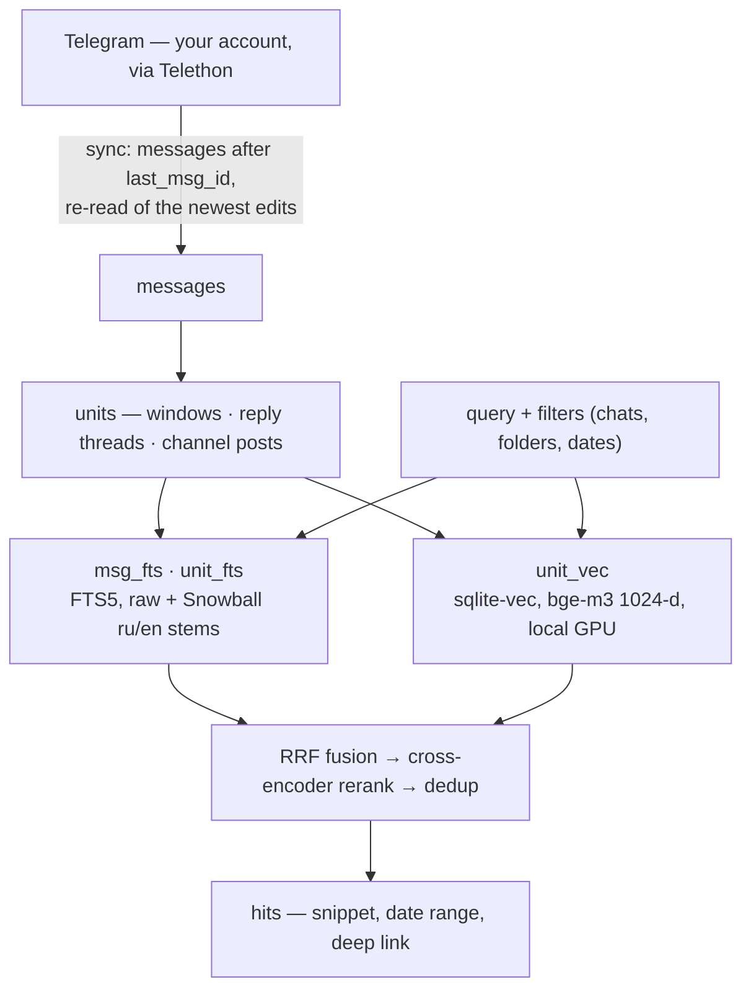

# :mag: grepogram — Semantic Search for Your Telegram Chats

[](https://github.com/nnemirovsky/grepogram/actions/workflows/ci.yml)
[](https://github.com/nnemirovsky/grepogram/releases/latest)
[](pyproject.toml)
[](LICENSE)

Ask your Telegram history a real question and get the conversation that answers it — the whole
thread, when it was said, and a link that opens the message in Telegram.

## Why grepogram

Community chats are where the answers live. Expat groups, city chats, hobby groups hold things no
web page does — how to open a bank account here without a DNI, which SIM works in the mountains,
whether the visa run still works after the June rules. Finding any of it again is the hard part.

**The problem:** Telegram matches exact words. `счёт` misses `счета`, `bank` misses `banks`, and a
paraphrase misses everything. The answers that matter are worse than a single keyword away: they
sit in reply chains, spread across several messages, switch between two languages, and go stale
after a rule change. Embedding single messages does not rescue this either — one chat message is
too short to carry meaning, and the answer usually turns on an exact token anyway: a bank name,
`ВНЖ`, `CUIT`.

**The solution:** grepogram indexes *conversations*, not messages. It syncs the chats you opt in
to through the Telegram user API, groups them into conversation-sized units — time windows, reply
threads, channel posts — and indexes every unit twice: lexically with FTS5 and Russian/English
stemming, so exact tokens still win, and densely with `bge-m3` vectors, so a paraphrase lands.
Both rankings are fused with Reciprocal Rank Fusion, re-scored by a local cross-encoder, and
returned with dates and deep links. An MCP server hands those tools to your agent along with a
playbook for using them: run several query variants, read the thread before concluding, cite a
link per claim.

Your agent supplies the reasoning; grepogram supplies the retrieval. Both models run on your
machine, and every message, vector and query stays in a SQLite file you own.

## How It Works



Two front ends share that index: `grepogram-mcp`, a stdio MCP server for Claude Code, Cursor,
Codex or any other MCP client, and the `grepogram` CLI for the same searches in a terminal.
Everything lives in one SQLite file.

## Requirements

- macOS. On Apple Silicon the models run on Metal (`mps`), otherwise on the CPU; `open_message`
  uses `open`, and the default paths follow macOS conventions. The code runs elsewhere with
  `GREPOGRAM_HOME` set, but that is untested.
- [uv](https://docs.astral.sh/uv/). The project pins CPython 3.12 (`torch` and `sqlite-vec`
  wheels); uv installs it. The interpreter's `sqlite3` module must be able to load extensions —
  uv-managed and Homebrew builds can, Apple's system Python cannot.
- A Telegram account and an API key pair from https://my.telegram.org/apps.
- Optional: about 4.5 GB of disk for the two models (`BAAI/bge-m3`, `BAAI/bge-reranker-v2-m3`),
  downloaded from Hugging Face on first use. Without them every search runs lexical-only.

## Setup in Five Minutes

1. Create an application at https://my.telegram.org/apps and note the `api_id` and `api_hash`.

2. Install. Either as a tool, from a checkout:

   ```sh
   git clone https://github.com/nnemirovsky/grepogram
   cd grepogram
   uv tool install '.[dense]'     # or `uv tool install .` for lexical-only search
   ```

   which puts `grepogram` and `grepogram-mcp` into `$(uv tool dir --bin)`, or from the checkout
   without installing:

   ```sh
   uv sync --extra dense          # or plain `uv sync`
   uv run grepogram --help        # prefix every command below with `uv run`
   ```

3. Write the config and fill in the keys:

   ```sh
   grepogram config init
   grepogram config path          # prints where config, session, index and log live
   ```

   Edit `~/.config/grepogram/config.toml` and set `[telegram] api_id` and `api_hash`.

4. Sign in. The session is stored as `~/.config/grepogram/session.session` with mode 0600:

   ```sh
   grepogram auth                 # phone number, login code, 2FA password if enabled
   ```

5. Pick what to index. Nothing is indexed unless you add it:

   ```sh
   grepogram dialogs argentina                        # find chats and folders by name
   grepogram sources add "folder:Argentina"           # a Telegram folder (all its chats)
   grepogram sources add @ru_georgia                  # a public chat by username
   grepogram sources add "Buenos Aires chat"          # a chat by (fuzzy) title
   grepogram sources add @somechannel --comments      # a channel plus its discussion threads
   grepogram sources add --since 2024-01-01 -- -1001234567890   # by id (after --), skipping older history
   grepogram sources ls
   ```

6. Sync. The first run fetches the whole history of every source (or from `--since`), builds
   the units, indexes them and, when the `dense` extra is installed, downloads `bge-m3` and embeds
   everything. `--budget` caps the run; the next run continues where it stopped:

   ```sh
   grepogram sync --budget 600
   grepogram search "открыть счёт без DNI"
   ```

7. Connect your agent. `grepogram-mcp` speaks MCP over stdio, so any client that launches a
   command works. In Claude Code, with a checkout at `<path>`:

   ```sh
   claude mcp add grepogram -s user -- uv run --project <path> grepogram-mcp
   ```

   or, after `uv tool install`:

   ```sh
   claude mcp add grepogram -s user -- "$(uv tool dir --bin)/grepogram-mcp"
   ```

   Clients that take a JSON config (Cursor, Windsurf, Codex and others) want the same command:

   ```json
   {
     "mcpServers": {
       "grepogram": { "command": "/absolute/path/to/grepogram-mcp", "args": [] }
     }
   }
   ```

   Then ask something like "what do people in the Argentina chat say about opening a bank account
   without a DNI?". The first search downloads the reranker if it is not cached yet.

Run `grepogram sync` whenever you want the index current; the MCP `search` tool also refreshes an
index older than an hour on its own (see below). A `launchd` job or a cron entry calling
`grepogram sync --budget 300` works fine next to a running MCP server: only one sync runs at a
time, and the two never contend for the session file.
## CLI Reference

Global options: `--version`, `--verbose` / `-v` (DEBUG logging). Command output goes to stdout,
diagnostics and logs to stderr and the log file.

| command | what it does |
|---|---|
| `grepogram config init` | write the annotated config template; refuses to overwrite |
| `grepogram config path` | print the resolved config, session, index, lock and log paths |
| `grepogram auth` | sign in (phone, code, optional 2FA password) and store the session |
| `grepogram dialogs <query> [-n N]` | find chats and folders of the account whose title, `@username` or folder name matches; prints kind, id, type, title, username, folders, score |
| `grepogram sources add <target> [--since YYYY-MM-DD] [--comments]` | add a source and save the config; `target` is a chat id, `@username`, `t.me` link, `folder:<name>` or a fuzzy chat / folder title |
| `grepogram sources ls` | configured sources with their chats, message counts and last sync |
| `grepogram sources rm <target>` | remove a source and delete its chats' messages and index rows; `target` is a source id as `sources ls` prints it (`folder:<name>`, `chat:@name`, `chat:-100…`), a folder name, a chat id, `@username` or a fuzzy title; refuses while a sync is running |
| `grepogram sync [--budget S]` | fetch new messages from every source, rebuild units, index and embed; stops cleanly after `S` seconds (at least 1) |
| `grepogram embed [--reembed]` | embed units the dense index does not hold yet; `--reembed` drops every vector and starts over (needed after changing `[models] embed`); refuses while a sync is running |
| `grepogram search <query> …` | search the index, see below |
| `grepogram-mcp [-v]` | the MCP server over stdio (what an MCP client launches) |

Chat ids are negative for groups, supergroups and channels (`-100…`); when one is a positional
argument, put `--` before it: `grepogram sources add --since 2024-01-01 -- -1001234567890`.

`search` options:

| option | meaning |
|---|---|
| `-c`, `--chat <spec>` | restrict to these chats (repeatable): id, `@username`, `t.me` link, `folder:<name>` or a title / folder name (substring, then fuzzy) |
| `--since <when>`, `--until <when>` | date bounds on the unit's start: an ISO date (`2025-06-01`), month (`2025-06`), datetime (`2025-06-01T14:30`, optional seconds and `Z` / `+03:00`) or an age (`7d`, `3w`, `6m`, `1y`); `--until` is inclusive; naive input is UTC |
| `--mode hybrid\|lexical\|dense` | `hybrid` (default) fuses BM25 and embeddings, `lexical` is BM25 over stems only, `dense` is embeddings only; without vectors or a model every mode falls back to lexical with a warning |
| `-k`, `--limit N` | number of hits (default `[search] k`) |
| `--rerank` / `--no-rerank` | re-score the candidates with the cross-encoder (default on; skipped with a warning when the model cannot load) |
| `--full` | include each hit's whole unit text |
| `--json` | print the result document as JSON and nothing else on stdout |

Text output prints one block per hit — rank, score, unit kind, chat, UTC date range, the deep link
(and a fallback link for private chats), then the snippet.

## MCP Tools

The server is named `grepogram`. Every tool returns one JSON object. Expected failures — no
session, another sync running, an unknown chat or message, a model that cannot load, an
ambiguous target — come back as `{"error": …, "hint": …}` (plus `candidates` when there is
something to choose from) rather than a tool error, so the agent can act on them. `warnings` are
advisory; the data next to them is valid.

| tool | arguments | returns |
|---|---|---|
| `search` | `query`, `chats: list[str] \| null`, `since`, `until`, `k=10`, `mode="hybrid"`, `rerank=true`, `full=false` | `{hits, warnings, index_age_min, synced}`; each hit has `score`, `chat` (id, type, title, username, …), `kind` (`window` / `thread` / `post`), `date_start`, `date_end` (unix seconds, UTC), `anchor_msg_id`, `url`, `fallback_url`, `snippet`, `msg_ids`, `text` (with `full`) |
| `thread` | `chat_id`, `msg_id` | `{chat_id, msg_id, messages}`: the whole reply thread the message belongs to, root first; for a channel post, the post followed by its comments |
| `context` | `chat_id`, `msg_id`, `before=15`, `after=15` | `{chat_id, msg_id, messages}`: the surrounding messages in the same chat or forum topic |
| `sync` | `budget_s=45` | the sync report: `new`, `chats_done`, `chats_remaining`, `unavailable`, `warnings`, `index_age_min` |
| `sources` | — | `{sources, index_age_min}`: every configured source with its chats (`id`, `title`, `type`, `username`, `message_count`, `last_sync_at`, `unavailable`) |
| `dialogs` | `query` | `{query, matches}`: chats and folders of the account matching the name; each match carries `kind`, `id`, `title`, `type`, `username`, `folders`, `score` and `target`, the string to pass to `sources_add` |
| `sources_add` | `target`, `since=null`, `comments=false` | `{source, kind, title, chats, hint}` after saving the config |
| `sources_remove` | `target` | `{source_id, removed_chat_ids, config_updated}` after deleting the chats' data; `target` is a source id from `sources` (`folder:<name>`, `chat:<value>`), a folder name, a chat id, `@username` or a fuzzy title; `error` while a sync is running |
| `open_message` | `chat_id`, `msg_id` | `{chat_id, msg_id, url, fallback_url, app_url, opened, opened_with}`; launches the `tg://` `app_url` through `open` (the `https://t.me` `url` and then `fallback_url` only when the app form is rejected) and says which one worked; when none can be launched — or `GREPOGRAM_NO_OPEN` is set — the result still carries the links plus `error` and `hint` |

Messages in `thread` and `context` have `msg_id`, `date`, `from_name`, `text` (a `[photo]`-style
placeholder for media without a caption), `url`, `fallback_url` and `reply_to_msg_id`.

The server's `instructions` tell the agent how to use the tools: run two or three query variants
(Russian and English, the specific term and the concept, synonyms), prefer `lexical` for exact
tokens such as bank names or IDs, prefer recent hits for anything regulatory or price-related and
state the date of the evidence, call `thread` or `context` before concluding from a snippet, cite
the hit's `url` per claim, say so when nothing relevant comes back, and use `sources` / `dialogs`
/ `sources_add` / `sync` when the user names a chat that is not indexed yet.

The server re-reads `config.toml` when the file changes, so a source added with the CLI while
an agent session runs is picked up by the next tool call. Every change to the file — by the server or
by `grepogram sources add` / `rm` in a terminal — is a read-modify-write under `config.lock`, so
one side's save never undoes the other's. Models are loaded once per server process; a model that
fails to load is not retried until the server restarts.

## Configuration

`grepogram config init` writes this file to `~/.config/grepogram/config.toml` (mode 0600). Every
key is optional; the values shown are the defaults. `grepogram sources add` / `rm` rewrite the
file without comments.

```toml
[telegram]
api_id = 0                             # create an app at https://my.telegram.org/apps
api_hash = ""

[models]
embed = "BAAI/bge-m3"                  # sentence-transformers id; change → full re-embed
rerank = "BAAI/bge-reranker-v2-m3"
device = "auto"                        # auto → mps if available else cpu

[search]
k = 10
rrf_k = 60
rerank_top = 40
dedup_overlap = 0.5
vec_fanout_max = 8                     # above this many chats → one KNN with k*4, post-filtered
auto_sync_after_min = 60
auto_sync_budget_s = 20

[units]
window_gap_min = 30
window_max_msgs = 30
window_max_chars = 1500
thread_max_msgs = 40

[sync]
edit_refetch = 200
flood_sleep_threshold = 120

# Sources are opt-in. Add them with `grepogram sources add <target>` or by hand:
#
# [[sources]]
# folder = "Argentina"
#
# [[sources]]
# chat = "@ru_georgia"                 # or "https://t.me/…" or 123456789
# since = "2024-01-01"                 # optional: skip older history on first sync
# comments = false                     # channels only: also index linked discussion threads
```

| key | meaning |
|---|---|
| `telegram.api_id`, `telegram.api_hash` | the application credentials from my.telegram.org; every command that talks to Telegram refuses to run while they are unset |
| `models.embed` | sentence-transformers model for the dense index; the model name and vector width are recorded in the index, and a change is refused until `grepogram embed --reembed` |
| `models.rerank` | sentence-transformers cross-encoder used when `rerank` is on |
| `models.device` | `auto`, `mps` or `cpu`; on `mps` the weights run in fp16 |
| `search.k` | default number of hits for the CLI |
| `search.rrf_k` | the constant in `1 / (rrf_k + rank)` |
| `search.rerank_top` | how many fused candidates the cross-encoder re-scores; each retrieval list is fetched `max(k, rerank_top)` deep |
| `search.dedup_overlap` | drop a hit when at least this share of its message ids already belongs to a better hit of the same chat; a value above 1.0 disables dedup |
| `search.vec_fanout_max` | a chat filter with up to this many chats runs one KNN per chat (sqlite-vec partition key); above it one KNN over-fetches four times deeper and filters afterwards |
| `search.auto_sync_after_min` | the MCP `search` tool runs a sync first when the index is older than this many minutes; the CLI only prints a note |
| `search.auto_sync_budget_s` | the time cap of that automatic sync |
| `units.window_gap_min` | a pause longer than this closes the current window |
| `units.window_max_msgs`, `units.window_max_chars` | a window also closes at this many messages or this many characters of rendered text |
| `units.thread_max_msgs` | a reply thread longer than this continues in further units, each repeating the root |
| `sync.edit_refetch` | how many of the newest messages of each chat are re-read to pick up edits and reaction counts — after every sync that finishes the chat's incremental pass (skipped on the chat's first sync and when the budget stops the chat); for a channel with `comments` the re-read posts whose reply count grew get their threads fetched again |
| `sync.flood_sleep_threshold` | Telethon sleeps through a `FloodWait` up to this many seconds; a longer one stops the run with a warning and the chats resume next time |
| `sources[].folder` | a Telegram folder by name; its membership (included and pinned chats minus excluded ones, plus category flags) is re-resolved on every sync |
| `sources[].chat` | one chat: `@username`, `https://t.me/…` link or the id printed by `grepogram dialogs` (Telethon's marked form, `-100…` for channels and supergroups) |
| `sources[].since` | `YYYY-MM-DD`; history before this date is skipped on the first sync of the chat |
| `sources[].comments` | channels only: index the comment threads of the linked discussion group as well; on a folder source it applies to every channel in the folder. The comments are stored under the group with the post id attached; a source that lists the group itself (the folder holding both, or a `chat` entry) indexes its whole history on top, and the two share one set of rows |

`GREPOGRAM_HOME=<dir>` puts every file (`config.toml`, `config.lock`, `session.session`,
`index.db`, `sync.lock`, `logs/`) under one directory; the tests use it. `GREPOGRAM_FAKE_MODELS=1`
swaps both models for deterministic fakes (tests and CI only). `GREPOGRAM_NO_OPEN=1` makes
`open_message` return the link without launching anything; the test environment sets it, so
nothing run under it can open Telegram or a browser on the machine.

## How Search Works

**Units.** Single messages are too short to embed, and the answer to a question usually spans
several of them. The index therefore holds *units*: per chat (and per forum topic) the history is
cut into *windows* — chronological runs that end at a pause of more than `window_gap_min`
minutes, at `window_max_msgs` messages or at `window_max_chars` characters; every message that
got replies and has no parent in the chat becomes the root of a *thread* (root plus all
descendants, chronological, capped at `thread_max_msgs` with continuation units that repeat the
root); every channel message is a *post*, and with `comments = true` a thread of the post with its
comments. A discussion group indexed as a chat of its own is one linear conversation: its windows
run across comments and general talk alike, the way the group reads in Telegram, while the
channel's post threads give the per-post view. A unit's text is one line per message,
`[YYYY-MM-DD HH:MM] name: text`, with
`[photo]` / `[voice]` / `[document: name.pdf]` placeholders for media without a caption. A sync
re-cuts only the open window of each touched chat — or, when a message arrived below it that no
window holds yet (a channel storing a comment in its group ahead of the group's own history, a
late comment on an old post), the windows from the one before that message on — and rebuilds only
the threads reachable from new or edited messages; unchanged units keep their rows and their
vectors.

**Lexical.** Two FTS5 tables (`unicode61`, diacritics removed) hold a `raw` and a `stemmed` column
each — one for whole units, one for single messages so that a message packing every query term
into one line still stands out among long windows. Stemming is Snowball, chosen per token by
script: Cyrillic tokens go through the Russian stemmer (which also folds `ё` to `е`), Latin
tokens through the English one, everything else is kept as typed; nothing is dropped, so `ВНЖ`,
`DNI` and `2024` stay searchable. A query is stemmed the same way, every stem is quoted so that
`bge-m3` or `12:30` cannot break the FTS5 syntax, and the terms are joined with `AND` first, then
with `OR` when fewer rows than wanted match. Ranking is `bm25()` with the `raw` column weighted
twice the `stemmed` one. Message hits are mapped to the window or post that holds them.

**Dense.** Units are embedded with `bge-m3` (1024-d, normalised, 512-token cap, fp16 on Metal)
into a sqlite-vec `vec0` table partitioned by chat; the query is embedded the same way and
searched by cosine distance, with the date bounds as metadata constraints. Vectors are keyed by
the unit's rowid, so a re-cut window's old vector is deleted with the unit and can never resurface.
The model name and width are recorded in the index and checked before every query.

**Fusion, rerank, dedup.** The three lists — units by BM25, messages by BM25 mapped to their
units, units by cosine — are merged with Reciprocal Rank Fusion, `Σ 1 / (rrf_k + rank)`, which
needs no score calibration between tables: a unit near the top of two lists outranks one found
by a single list. The fused top `rerank_top` are re-scored by the cross-encoder on
`(query, unit text)` and re-sorted. Then near-duplicates go: a hit is dropped when at least
`dedup_overlap` of its own message ids already belong to a better hit of the same chat, so a
thread inside a window that ranks higher disappears while a window extending a better-ranked
thread survives. The top `k` survivors are returned. `mode` picks the retrieval lists; reranking
and dedup apply in every mode, including the lexical fallback.

**Degradation.** The dense side is used only when vectors exist and come from the configured
model. No vectors yet, the `dense` extra missing, a model that cannot load, a model change without
`--reembed` — each turns into a `dense search unavailable: …` warning and a lexical search. A
reranker that cannot load adds `reranking unavailable: …` and the fused order stands. No Metal
means CPU with a one-time warning in the log.

**Filters.** Chat specs are resolved against the indexed chats — an id, `@username`, a `t.me`
link, `folder:<name>` (through the source that pulled the chats in), or free text matched against
titles, usernames and folder names (substring first, then a `SequenceMatcher` ratio of at least
0.6; all hits of the best tier are searched). A spec that matches nothing is an error listing what
is indexed. Date bounds apply to the unit's start time; `until` covers the whole day or month
named; relative ages (`6m`) step the calendar rather than counting 30-day months.

**Snippets and links.** Every hit has an *anchor*, the message its link opens: the matched message
for a message-level hit, otherwise the unit's best message under the query, else its first. The
snippet leads with the anchor's line and adds neighbours from within the unit up to 600
characters. A channel's post thread is anchored and linked on the post, but its snippet is cut
from the unit text and leads with the line — the post or one of its comments — that shares the
most word stems with the query, so a hit that owes its rank to a comment shows that comment.
Links follow Telegram's rules per chat type: `https://t.me/<username>/<msg>` for
public channels and supergroups, `https://t.me/c/<id>/<msg>` for private ones (with the topic
inserted for forums), `tg://openmessage?user_id=…&message_id=…` for private chats and bots with
`tg://user?id=…` as fallback, `tg://openmessage?chat_id=…&message_id=…` for legacy groups. Those
are the links results carry, for showing and citing. `open_message` launches the app form
instead — `tg://resolve?domain=<username>&post=<msg>` for public chats,
`tg://privatepost?channel=<id>&post=<msg>` for private ones, `&thread=<topic>` added in a forum
topic, the `tg://openmessage` forms as they are — because macOS routes `tg://` straight to the
Telegram app while `open https://t.me/…` lands on the t.me page in the browser; the `https` link
and then the fallback are tried only when the app form is rejected (no Telegram installed).

**Staying current.** `sync` re-resolves every source (folders change), then syncs chats in
`last_sync_at` order, never-synced first: new messages after the stored `last_msg_id` in batches
of 500, then a re-read of the newest `edit_refetch` messages that rewrites only rows whose content
changed (that re-read runs after every sync that finishes the chat's incremental pass, not on
its first sync or one the budget cut short). With `comments` on, only the posts Telegram reports
comments on cost a thread request; a thread that starts later is picked up by the re-read while
the post is among the newest. A budget stops the run cleanly between batches and the report
lists `chats_remaining`. Every stored message stays flagged until its units and its row in the
message index exist: a run indexes what it committed even when a flood wait, an error or a
cancelled tool call stops the fetch, and the next run picks up whatever a crash left behind, for
the chats it reaches and for the ones it does not. The rebuild, the index rows and the flag are
one transaction, and each run checks the units of the chats it indexes against the unit index, so
a run interrupted by an older version — or by a killed process — is repaired rather than marked
done, and no re-download is ever needed. A non-blocking file lock keeps two syncs off
the same index:
a CLI `sync`, `embed`, `sources rm` or MCP `sync` / `sources_remove` started while another sync
runs fails at once with `SyncInProgress`, and the MCP `search` auto-sync turns that into a
warning. Inside the MCP server, syncs queue instead: a `search` that finds the index stale while
another tool call is already syncing waits for it — for at most `auto_sync_budget_s` seconds —
and then searches the fresh index; a sync still running after that is reported as a warning and
the search runs on the index as it is. A sync resolves its sources from the config as it is once
it holds the lock, so a source removed while the sync was still loading its model or connecting
is not fetched again. Chats
Telegram refuses (left, kicked, private) are marked `unavailable`, retried on every sync, and
cleared when they succeed again; a legacy group that was upgraded to a supergroup is followed to
its new id. When the MCP `search` tool finds the last sync run older than `auto_sync_after_min`,
it first runs a sync capped at `auto_sync_budget_s` seconds (a flood wait is never slept through
for longer than the budget has left) and reports `synced: true`; anything that goes wrong with
that refresh — no session, a running sync, a flood wait — becomes a warning and the search runs
on the index as it is. A never-synced index is not refreshed automatically — the first `sync`
(CLI or tool) is explicit.

Only `grepogram auth` writes the session file. Every other client — each CLI command and each
Telegram-using MCP tool call — reads it into memory at start and works on that copy: Telethon
writes to its session database on nearly every request and commits once a minute, so two clients
on one file would block each other for the SQLite busy timeout and then fail with `database is
locked`. A cron `grepogram sync` and the MCP server therefore never get in each other's way, and
a session created with `grepogram auth` while the server runs is picked up by its next call.

## Files and Privacy

| file | purpose | mode |
|---|---|---|
| `~/.config/grepogram/config.toml` | settings, API keys, sources | 0600 |
| `~/.config/grepogram/session.session` | Telethon session with the account's auth key | 0600 |
| `~/Library/Application Support/grepogram/index.db` | messages, units, FTS and vector tables (WAL) | — |
| `~/.config/grepogram/config.lock` | cross-process lock around every edit of `config.toml` | 0600 |
| `~/Library/Application Support/grepogram/sync.lock` | cross-process sync lock | 0600 |
| `~/Library/Logs/grepogram/grepogram.log` | log, rotated at 5 MB, three old files kept | — |
| `~/.cache/huggingface/hub/` | the two models, downloaded once | — |

Directories are created with mode 0700. The session file grants full access to the Telegram
account; treat it like a password and delete it (or terminate the session in Telegram's settings)
when you stop using grepogram.

Two kinds of traffic leave the machine: MTProto requests to Telegram from your own account — the
same ones a client makes when you scroll a chat — and a single download per model from
`huggingface.co` the first time the `dense` extra needs one. Message text, embeddings, queries and
results stay in the SQLite file and in the conversation with your agent, both on your machine.
Embedding and reranking run locally, so a search costs a Telegram round trip at most; the language
model is whichever agent you connect, and grepogram itself needs only your Telegram credentials.
Logs keep message text below DEBUG level, where it is replaced by its length and a short digest.
The one thing grepogram launches is macOS `open`, for `open_message`; `GREPOGRAM_NO_OPEN=1` makes
that return the link instead.

## Local Model Throughput

Measured with `uv run pytest -m slow` on an Apple M1 Pro (16 GB) with both models already in
the Hugging Face cache (`HF_HUB_OFFLINE=1`), fp16 on MPS, `max_seq_length = 512`:

| model | work | throughput |
|---|---|---|
| `BAAI/bge-m3` | embedding window-sized units (64 units of six lines, batch 32) | 40.9 units/s |
| `BAAI/bge-reranker-v2-m3` | scoring `(query, unit)` pairs (`rerank_top = 40`) | 37.7 pairs/s |

Loading takes about 8 s for the embedder and 3.5 s for the reranker, once per process. At these
rates a query has its 40 candidates reranked in about a second, and 10 000 units embed in about
four minutes.

## Known Limitations

- Deep links into private chats and legacy groups use the `tg://openmessage` scheme, which
  Telegram's mobile apps honour; the desktop apps open the conversation through the
  `tg://user?id=` fallback but do not scroll to the message. Channel and supergroup links
  (`https://t.me/…`) work everywhere; `open_message` opens them through their `tg://` form so the
  desktop app, not a browser, receives them.
- The first sync of a large chat (hundreds of thousands of messages) takes a long time and may run
  into Telegram flood waits; a wait longer than `flood_sleep_threshold` stops the run and the next
  run continues, with everything the stopped run stored already searchable. Use `--since` on the
  source to cap history and `--budget` to bound a run; embedding runs at the rates above. A
  channel with `comments` adds one request per post that has a thread.
- Deleted messages are not removed from the index; they disappear when their source is removed.
  Edits are picked up only for the newest `edit_refetch` messages of a chat, and an edited message
  inside an already closed window keeps the old window text (its reply thread is rebuilt). New
  comments on a channel post are picked up the same way — for the newest `edit_refetch` posts,
  when Telegram reports more replies than are stored; edited or deleted comments are not.
- `since` on a source is that day's UTC midnight, and the bound is inclusive: a message stamped
  exactly at `00:00:00Z` is indexed. Telethon 1.44 hands `offset_date` to `messages.getHistory`
  untouched and filters nothing by date itself, so a `reverse=True` chunk is the complement of the
  server's exclusive "messages before this date" cut. (Telethon's docstring calls the reversed
  bound exclusive, but only the *id* offset is compensated to stay so.) This has not been confirmed
  against a real long chat; if a first sync pulls the wrong side of the date, please open an issue.
- With `comments = true` and no source listing the discussion group itself, the group holds only
  the comment threads of the channel's posts and is removed together with the channel; list the
  group (in the folder, or as a `chat` entry) to index its whole history as well. The same comments
  then appear twice in the index — in the channel's post threads and in the group's windows — so a
  question about a post may surface both.
- A channel that loses its discussion group, or is given another one, drops the old link on its
  next sync: the comments already stored stay in the index as what they are — the messages of that
  group — but they stop being shown as the channel's comments, and the posts they hung under are
  rebuilt without them. The old group keeps being synced only if a source of its own lists it. A
  group Telegram reports but this account cannot open (it went private, say) leaves the comments
  out of that run, and drops the stored link when it is not that same group.
- A discussion group belongs to the source that brought it in: the folder or `chat` entry listing
  it when one does, and otherwise the source of the channel that links it now — so a group handed
  from one channel to another moves to the new channel's source, and removing the channel it left
  keeps it while removing the new one takes its comments along. A group no channel links any more
  keeps the source it came in through until that source is removed. A `chat` entry counts as
  listing the group under every spelling the field takes — the id, the `@username` and a `t.me`
  link are the same chat.
- Removing the source of a discussion group takes its comments out of the channel that stored
  them: the post threads built from them go with the group, and the posts are rebuilt without
  them on the next sync. Removing the channel instead leaves the group whole — its own windows
  and threads are its own messages — and only drops the link between the two.
- A chat that came in through a folder cannot be removed on its own; remove the folder source or
  take the chat out of the folder in Telegram. Nor can a channel's discussion group be removed
  through the channel's source by naming the group; remove the channel's source.
- Only one session at a time can be written: `grepogram auth` while another client has an
  uncommitted write open on the session file (a sync in another Telethon-based tool, say) can
  fail with `database is locked`; grepogram's own clients only read it.
- `sources add` / `rm` and the MCP tools rewrite `config.toml` without its comments.
- An index built with a development version before 2026-09-04 may hold messages no unit or
  message-index row covers (discussion-group history stored after the channel's comments, batches
  committed before a flood wait), and units the unit index is missing or holds stale rows for (a
  run killed between the unit rebuild and the indexing). The schema upgrade to v2 flags every
  stored message, so the first `grepogram sync` after upgrading rebuilds all units and index rows
  once — units whose content is unchanged keep their embeddings — and the consistency check every
  sync runs closes the unit-index gaps, both without a re-download. The upgrade to v3 leaves each
  channel a single discussion group, keeping the one such an index would have answered with; a
  channel whose group had changed picks the current one up on its next sync.
- The MCP contract targets the `mcp` 1.x SDK (`FastMCP`); 2.x renamed the API and is excluded by
  the dependency pin.

## Roadmap

- `sources prune` for chats that left a folder
- OCR of photos through macOS Vision, feeding the unit text
- Voice and video-note transcription (whisper.cpp)
- Text extraction from PDF and DOCX attachments
- `grepogram import <tdesktop export dir>` for chats no longer accessible from the account
- Handling of deleted messages; reaction counts as a ranking signal
- Publishing to PyPI

## Development

```sh
uv sync --all-extras --all-groups
uv run pytest                          # in-memory SQLite, fake models, no network
HF_HUB_OFFLINE=1 uv run pytest -m slow # real bge-m3 and reranker, once they are cached
uv run ruff check . && uv run ruff format --check . && uv run mypy
```

Conventions for contributors and coding agents are in [CLAUDE.md](CLAUDE.md).

## License

MIT, see [LICENSE](LICENSE).
